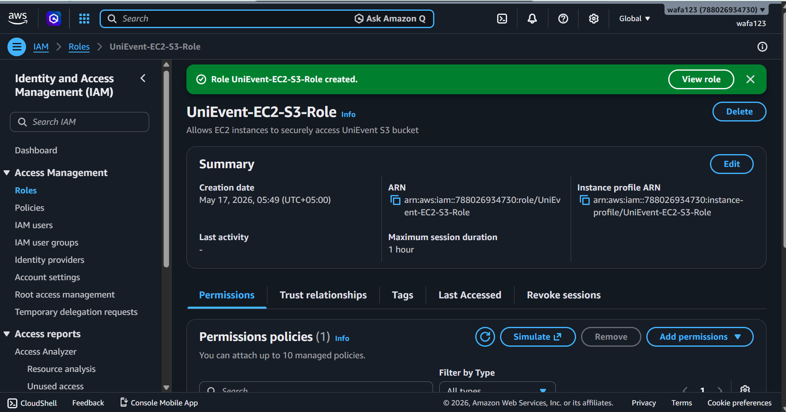
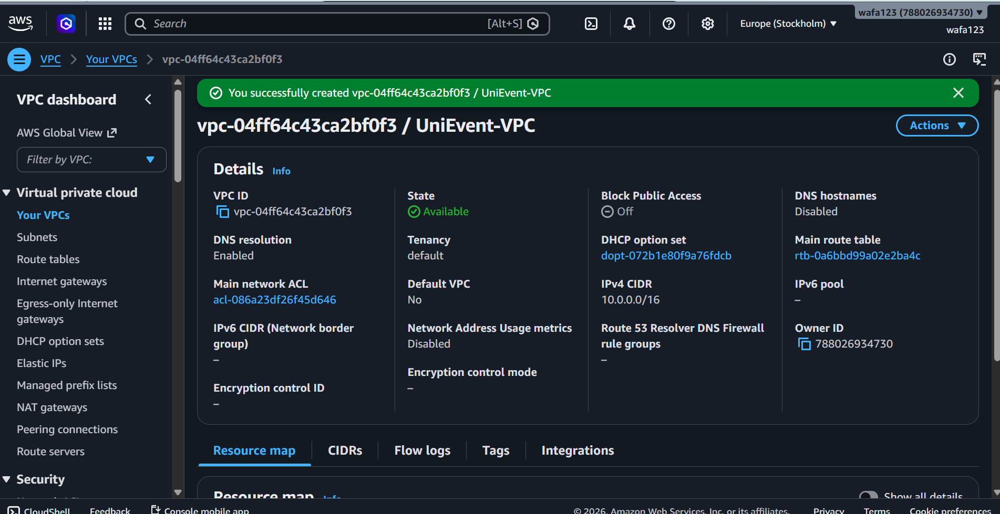
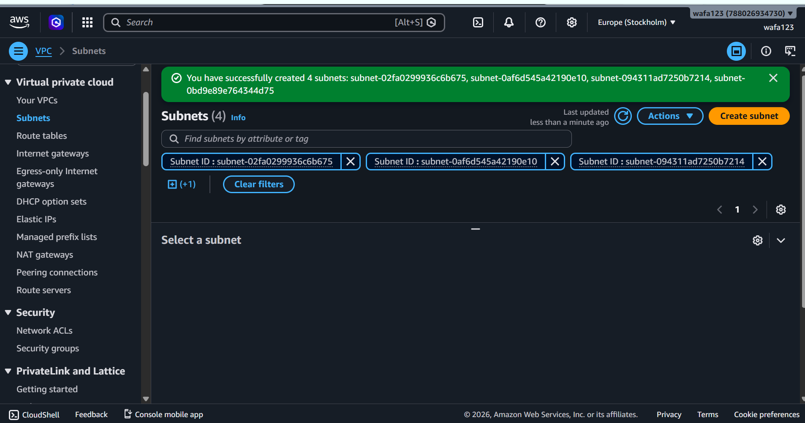
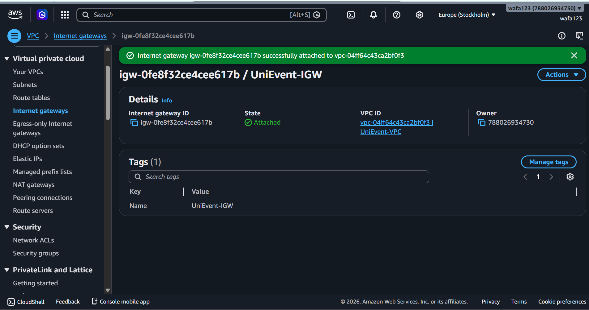
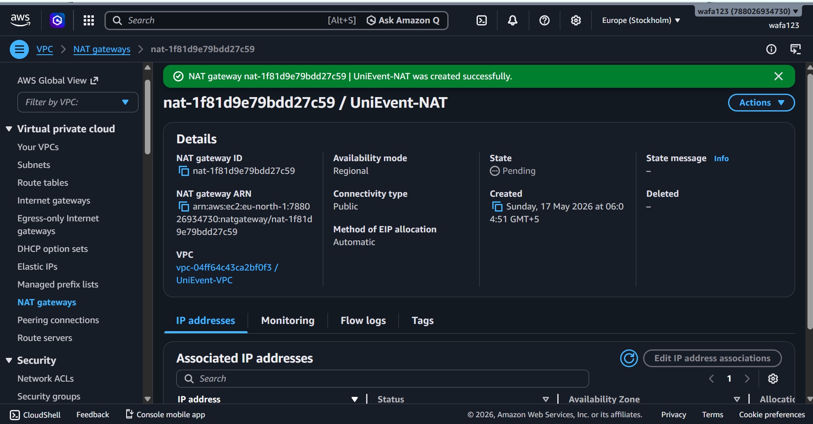
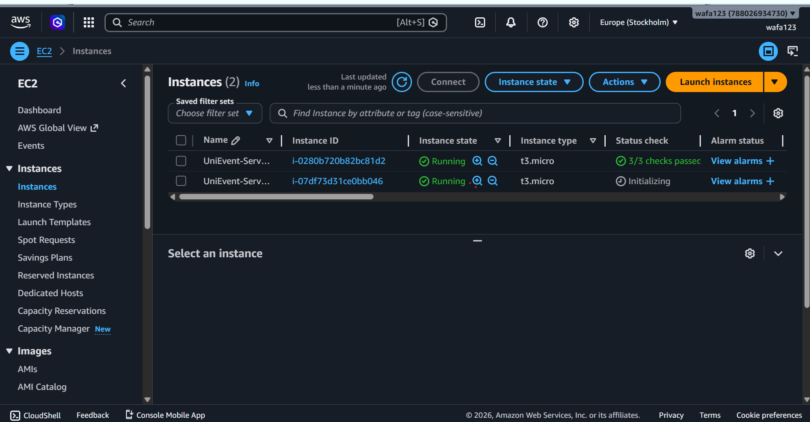
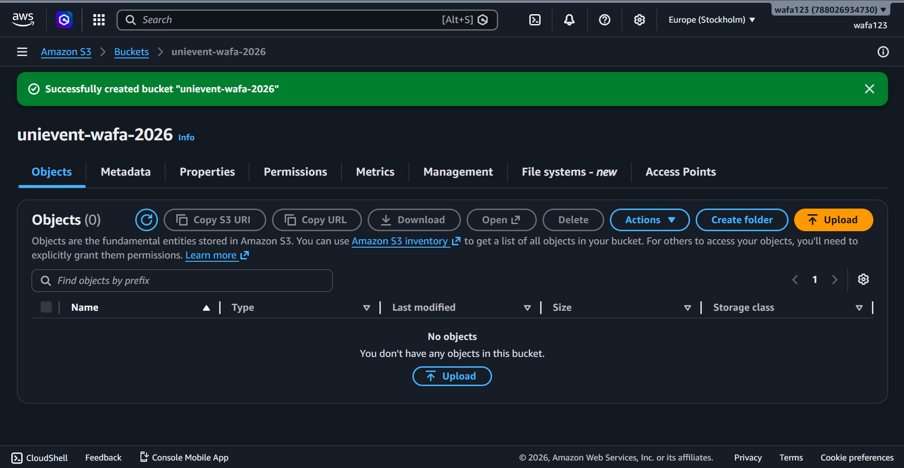
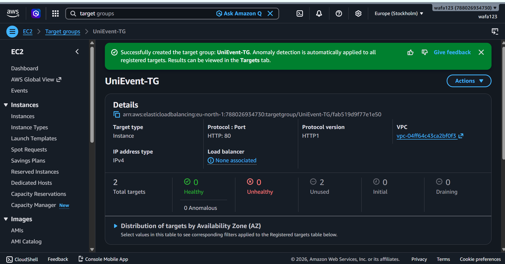
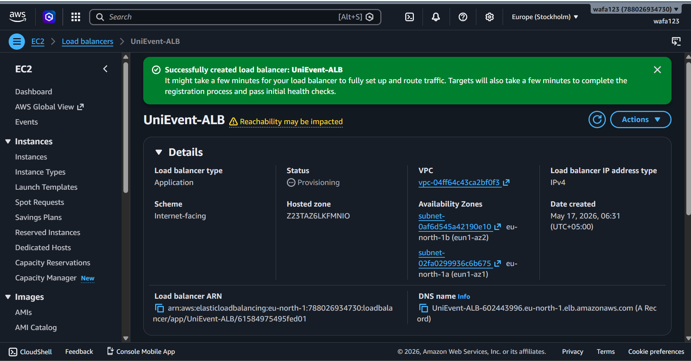
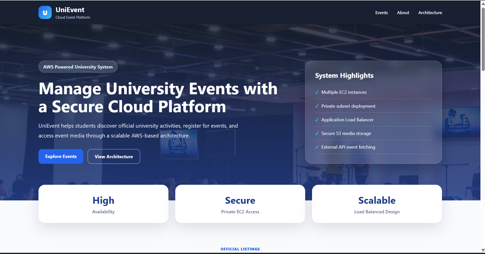

````markdown
# UniEvent – Deployment of a Scalable University Event Management System on AWS

## CE 308 Cloud Computing – Assignment 1

---

## Project Overview

UniEvent is a cloud-hosted university event management system designed to provide students with a centralized platform for discovering and registering for university events. Students can browse upcoming activities, view event information, and access event-related media such as posters and images.

The system is designed according to cloud best practices and emphasizes:

- Scalability
- High availability
- Security
- Fault tolerance
- Cloud-native deployment

The application integrates event information from an external source and presents it as official university events.

---

## Features

- Browse university events
- View event title, date, venue, and description
- Register for events
- Event media and posters storage
- External API integration concept
- Responsive professional user interface
- Fault-tolerant deployment
- Load-balanced architecture

---

## Technologies Used

### Frontend

- HTML5
- CSS3
- JavaScript
- JSON

### AWS Services

- IAM
- VPC
- EC2
- S3
- Elastic Load Balancer (ALB)
- NAT Gateway
- Internet Gateway
- Security Groups
- Target Groups

---

## External Events API

The UniEvent platform is designed to fetch event information from external event APIs.

Examples:

- Ticketmaster Discovery API
- Eventbrite API

For implementation and demonstration purposes, event data was loaded using a structured JSON source and JavaScript fetch requests.

Data fields include:

- Event title
- Date
- Venue
- Description
- Event image/poster

---

# System Architecture

Users access the application through an internet-facing Application Load Balancer.

The load balancer distributes traffic across multiple EC2 instances running inside private subnets.

EC2 instances retrieve and process event information.

Event posters and uploaded media are stored securely using Amazon S3.

IAM roles provide secure access between EC2 and S3.

The architecture ensures that if one EC2 instance fails, traffic automatically shifts to the healthy instance.

---

## AWS Architecture Diagram

```text
Users
   ↓
Application Load Balancer
   ↓
---------------------------------
|                               |
EC2 Instance 1           EC2 Instance 2
(Private Subnet)         (Private Subnet)
|                               |
---------------------------------
            ↓
       Amazon S3
            ↓
   External Event API
````

---

## AWS Configuration

### VPC

Name:

```text
UniEvent-VPC
```

CIDR:

```text
10.0.0.0/16
```

---

### Subnets

Public:

```text
Public-Subnet-1
10.0.1.0/24

Public-Subnet-2
10.0.2.0/24
```

Private:

```text
Private-Subnet-1
10.0.3.0/24

Private-Subnet-2
10.0.4.0/24
```

---

### IAM Role

```text
UniEvent-EC2-S3-Role
```

Purpose:

Provide secure access from EC2 instances to Amazon S3 without hardcoded credentials.

---

### S3 Bucket

```text
unievent-rizwan-2026
```

Used for:

* Event posters
* Uploaded media
* Application assets

---

### EC2 Instances

```text
UniEvent-Server-1
UniEvent-Server-2
```

Configuration:

* Amazon Linux
* t2.micro
* Private Subnets
* Apache Web Server

---

### Application Load Balancer

```text
UniEvent-ALB
```

Purpose:

Distributes incoming traffic across healthy EC2 instances.

---

### Target Group

```text
UniEvent-TG
```

Health check:

```text
Path: /
Protocol: HTTP
Port: 80
```

---

## Deployment Procedure

### Step 1

Created website frontend:

* index.html
* style.css
* script.js
* events.json

---

### Step 2

Created GitHub repository:

```text
Assignment1_AWS_CE
```

Uploaded all source files.

---

### Step 3

Created IAM role for secure S3 access.

---

### Step 4

Created VPC and configured:

* Public subnets
* Private subnets
* Route tables
* Internet Gateway
* NAT Gateway

---

### Step 5

Created Amazon S3 bucket.

---

### Step 6

Launched EC2 instances.

Installed:

```bash
httpd
git
```

Application deployment:

```bash
git clone https://github.com/wafaaa-abbas/Assignment1_AWS_CE.git .
```

---

### Step 7

Created Target Group and registered EC2 instances.

---

### Step 8

Created Application Load Balancer.

Configured listener:

```text
HTTP:80
```

---

### Step 9

Connected ALB to Target Group.

---

### Step 10

Verified application deployment using ALB DNS.

---

## Fault Tolerance Verification

To verify high availability:

1. One EC2 instance was stopped.
2. Application remained accessible.
3. ALB redirected traffic automatically.

Result:

System remained operational despite server failure.

---

## Security Considerations

* EC2 instances placed in private subnets
* S3 Block Public Access enabled
* IAM role used instead of access keys
* Security groups restricted traffic
* Application Load Balancer controls access

---

## Screenshots

### IAM Role



---

### VPC



---

### Subnets



---

### Internet Gateway



---

### NAT Gateway



---

### EC2 Instances



---

### S3 Bucket



---

### Target Group



---

### Load Balancer



---

### Website Running



---

## Repository Link

[https://github.com/wafaaa-abbas/Assignment1_AWS_CE](https://github.com/wafaaa-abbas/Assignment1_AWS_CE)

---

## Live Application


```text
(http://unievent-alb-602443996.eu-north-1.elb.amazonaws.com/)
```

---

## Conclusion

The UniEvent platform successfully demonstrates deployment of a scalable, secure, and fault-tolerant web application using AWS cloud services. The architecture follows cloud design principles and provides reliable service availability during high-demand periods.

```

```
